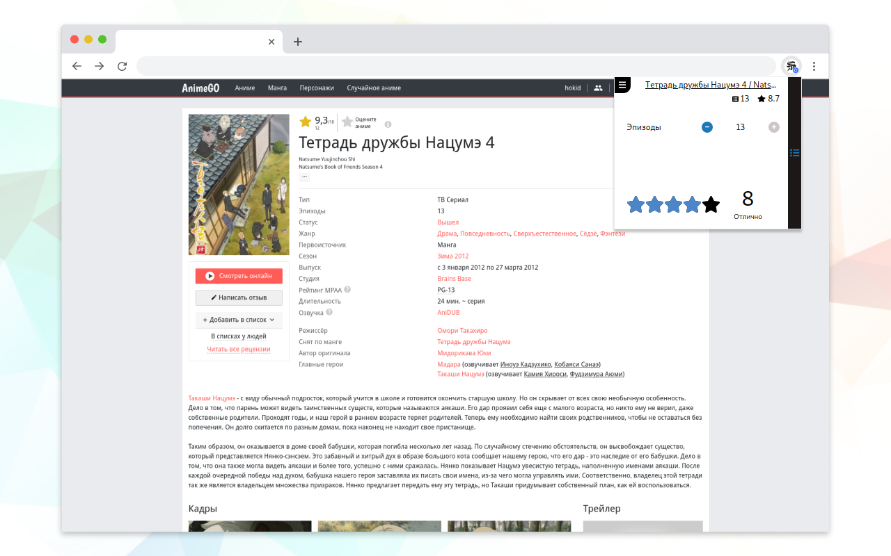
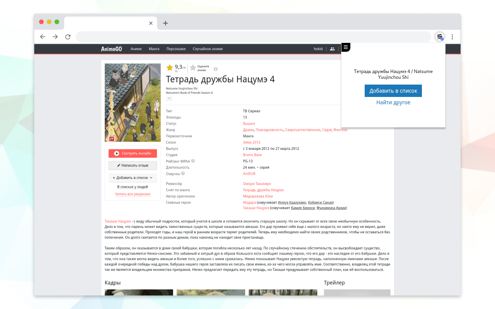
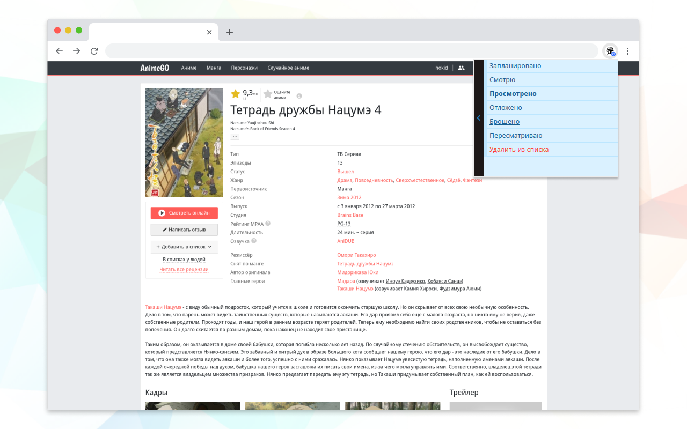

# Shikimorist

Быстрый доступ к списку аниме на [shikimori](https://shikimori.one). Отмечай серии, ставь оценку, добавляй аниме не выходя со страницы онлайн просмотра.

    

    
    
    

##### Установка

 - [Расширение для Chrome](https://chrome.google.com/webstore/detail/shikimorist/ldpjmfifbppiopmahkfajeghaapgnbda)

##### Как пользоваться

Авторизуйся на shikimori через расширение после установки. Переходи на страницу аниме на сайте онлайн просмотра(список поддерживаемых можно найти ниже) и открой расширение - оно автоматически найдет аниме в твоем списке, покажет статус, прогресс и оценку или предложит добавить его.

##### Возможности

 - Добавление аниме в список
 - Обновление статуса просмотра
 - Удаление аниме из списка
 - Обновление оценки
 - Обновления счетчика серий/пересмотров

##### Расширение поддерживает следующие сайты

 - [https://animego.org](https://animego.org)
 - [https://yummyanime.club](https://yummyanime.club)
 - [https://animestars.org](https://animestars.org)
 - [https://animebest.org](https://animebest.org)
 - [https://online.animedia.tv](https://online.animedia.tv)
 - [https://animevost.org](https://animevost.org)
 - [http://online.anilibria.life](http://online.anilibria.life)
 - [https://akari-anime.com](https://akari-anime.com)
 - [https://anime.anidub.life](https://anime.anidub.life)
