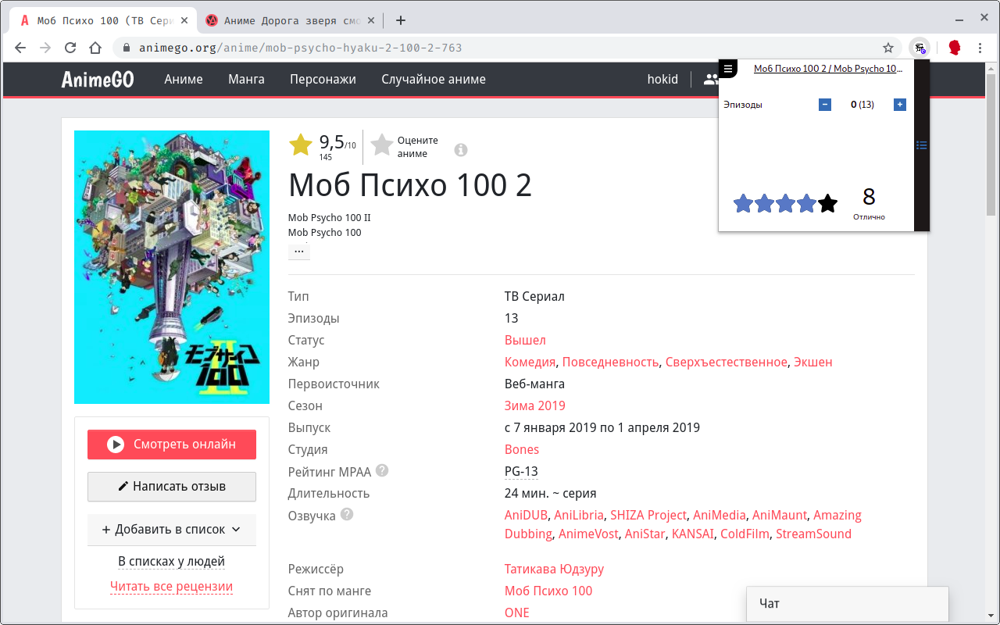

# Shikimorist

Обновляй свой список аниме(оценки, количество просмотренных серий) на [shikimori.org](https://shikimori.org) не выходя с любимого сайта онлайн просмотра.

    

##### Установка

 - [Расширение для Chrome](https://chrome.google.com/webstore/detail/shikimorist/ldpjmfifbppiopmahkfajeghaapgnbda)
 
##### Как это работает?

Вы переходите на страницу просмотра аниме, к примеру:

[https://yummyanime.club/catalog/item/v-podzemel-e-ya-pojdu-tam-krasavicu-najdu-strela-oriona](https://yummyanime.club/catalog/item/v-podzemel-e-ya-pojdu-tam-krasavicu-najdu-strela-oriona)

Открываете расширение, авторизуетесь, если еще не авторизовались. Далее расширение должно показать данные по аниме из вашего списка на [shikimori.org](https://shikimori.org) или предложить добавить его.

##### Возможности

 - Добавление аниме в список
 - Обновление статуса просмотра
 - Удаление аниме из списка
 - Обновление оценки
 - Обновления счетчика серий/пересмотров

##### Расширение поддерживает следующие сайты

 - [https://animego.org](https://animego.org)
 - [https://yummyanime.club](https://yummyanime.club)
 - [https://animestars.org](https://animestars.org)
 - [https://animebest.org](https://animebest.org)
 - [https://online.animedia.tv](https://online.animedia.tv)
